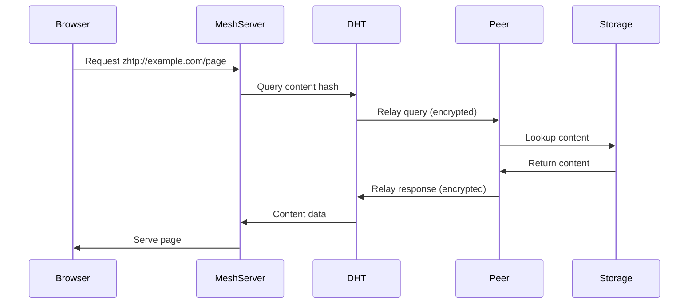
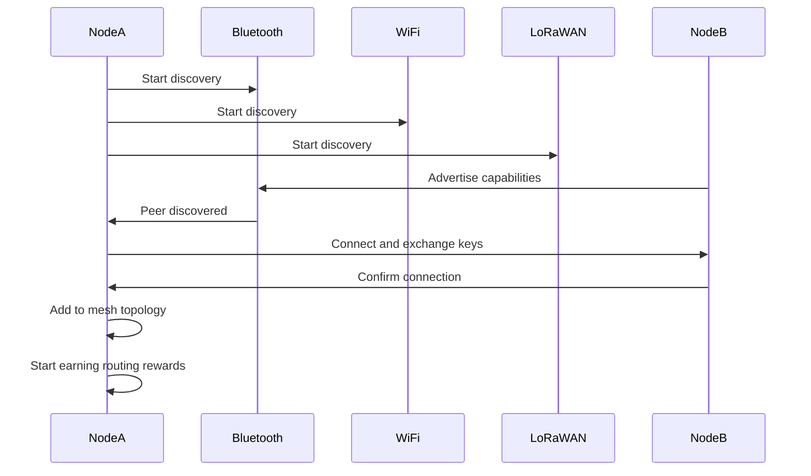
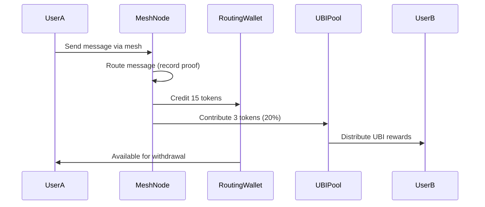

# ZHTP lib-network Architecture Overview

This document provides a comprehensive technical overview of the lib-network architecture and its role in the ZHTP mesh networking ecosystem.

##  Mission Statement

**lib-network enables the complete replacement of traditional Internet Service Providers (ISPs) through a decentralized, incentivized mesh networking system that provides free internet access while paying users for participation.**

## 🏗️ System Architecture

```
┌─────────────────────────────────────────────────────────────┐
│                        ZHTP Ecosystem                      │
├─────────────────────────────────────────────────────────────┤
│  Browser/Apps → lib-network → DHT → Global Mesh Network    │
└─────────────────────────────────────────────────────────────┘

                          ┌─────────────────┐
                          │  Applications   │ Web4 Sites, dApps
                          └─────────┬───────┘
                                    │
                          ┌─────────▼───────┐
                          │   ZhtpMeshServer │ Mesh Core
                          │  (lib-network)   │
                          └─────────┬───────┘
                                    │
            ┌───────────────────────┼───────────────────────┐
            │                       │                       │
    ┌───────▼────────┐    ┌────────▼────────┐    ┌────────▼────────┐
    │   Protocols    │    │   Discovery     │    │      DHT        │
    │                │    │                 │    │                 │
    │ • Bluetooth LE │    │ • Hardware      │    │ • Native Binary │
    │ • WiFi Direct  │    │ • Network Scan  │    │ • lib-storage   │
    │ • LoRaWAN      │    │ • Smart Routing │    │ • Web4 Content  │
    │ • Satellite    │    │ • Geo Location  │    │ • ZK Proofs     │
    └────────────────┘    └─────────────────┘    └─────────────────┘
            │                       │                       │
            │                       │                       │
    ┌───────▼────────┐    ┌────────▼────────┐    ┌────────▼────────┐
    │  lib-crypto    │    │  lib-economy    │    │  lib-storage    │
    │                │    │                 │    │                 │
    │ • Post-Quantum │    │ • Routing Rewards│   │ • Content Store │
    │ • Dilithium2   │    │ • UBI Payments  │    │ • Blockchain    │
    │ • Kyber KEM    │    │ • Token Economy │    │ • Replication   │
    └────────────────┘    └─────────────────┘    └─────────────────┘
```

##  Core Components

### 1. ZhtpMeshServer - The Core

The `ZhtpMeshServer` is the heart of the mesh networking system, coordinating all networking protocols and providing ISP-free internet access.

**Key Responsibilities:**
- **Multi-Protocol Coordination**: Manages Bluetooth, WiFi, LoRaWAN, and Satellite protocols
- **Economic Incentives**: Automatic token rewards for routing, storage, and relay services
- **Security Management**: Wallet-based authentication with emergency controls
- **Hardware Abstraction**: Cross-platform hardware detection and optimization

**Features:**
- ****: Direct peer-to-peer mesh networking without internet dependency
- **Earning While Connected**: Users automatically earn tokens for network participation
- **Global Coverage**: Local mesh with satellite uplinks for worldwide reach
- **Post-Quantum Security**: Future-proof cryptographic protection

```rust
// Core server architecture
pub struct ZhtpMeshServer {
    // Identity and Security
    pub owner_wallet_key: PublicKey,           // Node ownership
    pub routing_rewards_wallet: Arc<RwLock<QuantumWallet>>,
    pub security_audit_log: Arc<RwLock<Vec<SecurityAuditLog>>>,
    
    // Networking
    pub mesh_node: Arc<RwLock<MeshNode>>,      // Core mesh functionality
    pub mesh_connections: Arc<RwLock<HashMap<PublicKey, MeshConnection>>>,
    pub active_protocols: Arc<RwLock<HashMap<NetworkProtocol, bool>>>,
    
    // Protocol Instances
    pub bluetooth_protocol: Option<Arc<RwLock<BluetoothMeshProtocol>>>,
    pub wifi_direct_protocol: Option<Arc<RwLock<WiFiDirectMeshProtocol>>>,
    pub lorawan_protocol: Option<Arc<RwLock<LoRaWANMeshProtocol>>>,
    pub satellite_protocol: Option<Arc<RwLock<SatelliteMeshProtocol>>>,
    
    // Content and Storage
    pub dht: Arc<RwLock<ZkDHTIntegration>>,    // Content distribution
    pub storage: Arc<RwLock<UnifiedStorageSystem>>,
    
    // Economics and Incentives
    pub economics: Arc<RwLock<EconomicModel>>,
    pub revenue_pools: Arc<RwLock<HashMap<String, u64>>>,
    
    // Safety and Control
    pub emergency_stop: Arc<RwLock<bool>>,
    pub max_connections: Arc<RwLock<usize>>,
}
```

### 2. Multi-Protocol Stack

#### 📱 Bluetooth LE Protocol
- **Purpose**: Universal device connectivity (phones, laptops, IoT devices)
- **Range**: ~100 meters
- **Bandwidth**: ~1 Mbps
- **Key Features**: Low power, ubiquitous hardware support, phone-to-phone mesh

```rust
pub struct BluetoothMeshProtocol {
    pub node_id: [u8; 32],
    pub discovery_active: bool,
    pub connected_peers: HashMap<String, BluetoothPeer>,
    pub advertisement_data: Vec<u8>,
}
```

#### 📶 WiFi Direct Protocol
- **Purpose**: High-bandwidth local mesh connections
- **Range**: ~200 meters
- **Bandwidth**: ~250 Mbps
- **Key Features**: Direct peer-to-peer, no router required

```rust
pub struct WiFiDirectMeshProtocol {
    pub node_id: [u8; 32],
    pub group_info: Option<WiFiDirectGroup>,
    pub connected_clients: HashMap<String, WiFiDirectPeer>,
}
```

####  LoRaWAN Protocol
- **Purpose**: Long-range, low-power regional mesh
- **Range**: ~15 kilometers
- **Bandwidth**: ~50 kbps
- **Key Features**: Ultra-low power, penetrates buildings, regional coverage

```rust
pub struct LoRaWANMeshProtocol {
    pub node_id: [u8; 32],
    pub radio_config: LoRaWANConfig,
    pub gateway_connections: HashMap<String, LoRaWANGateway>,
}
```

#### 🛰️ Satellite Protocol
- **Purpose**: Global coverage for remote areas
- **Range**: Worldwide
- **Bandwidth**: ~100 Mbps (varies by provider)
- **Key Features**: Global reach, weather resilient, backup connectivity

```rust
pub struct SatelliteMeshProtocol {
    pub node_id: [u8; 32],
    pub satellite_provider: SatelliteProvider,
    pub uplink_sessions: HashMap<String, SatelliteSession>,
}
```

### 3. Native Binary DHT System

High-performance distributed hash table with lib-storage backend for content distribution and Web4 hosting.

**Architecture Highlights:**
- **Native Binary Protocol**: Efficient UDP-based packet format
- **Post-Quantum Signatures**: Dilithium2 signatures on all DHT operations
- **lib-storage Backend**: Unified storage system integration
- **ZHTP Relay Protocol**: Encrypted content relay through mesh peers

```rust
#[derive(Debug, Clone)]
pub struct DhtPacket {
    pub header: DhtPacketHeader,      // Fixed 128-byte header
    pub payload: DhtPacketPayload,    // Operation-specific data
    pub signature: PostQuantumSignature, // Cryptographic integrity
}

// DHT Operations
pub enum DhtOperation {
    Query,           // Content lookup
    QueryResponse,   // Content return
    Store,           // Content storage
    StoreAck,        // Storage confirmation
    PeerDiscovery,   // Peer finding
    RelayQuery,      // ZHTP encrypted relay
    RelayResponse,   // ZHTP encrypted response
}
```

### 4. Cross-Platform Discovery System

Intelligent hardware detection and network discovery for optimal protocol selection.

**Hardware Detection:**
- **Windows**: WinRT APIs, Device Manager integration
- **Linux**: BlueZ, NetworkManager, GPIO/SPI hardware
- **macOS**: Core Bluetooth, System Profiler

```rust
pub struct HardwareCapabilities {
    pub lorawan_available: bool,
    pub bluetooth_available: bool,
    pub wifi_direct_available: bool,
    pub hardware_details: HashMap<String, HardwareDevice>,
}

// Platform-specific detection
#[cfg(target_os = "linux")]
async fn detect_linux_lorawan_hardware() -> bool {
    // Check SPI devices, USB adapters, I2C modules, GPIO HATs
}

#[cfg(target_os = "windows")]
async fn detect_windows_lorawan_hardware() -> bool {
    // Check COM ports, Device Manager, WMI queries
}
```

### 5. Economic Incentive System

Automated token rewards for network participation, creating sustainable mesh economy.

**Reward Categories:**
- **Routing Rewards**: 10 tokens base + 1 token/KB + 5 tokens/hop
- **Storage Rewards**: 100 tokens per GB-day stored
- **Relay Rewards**: Variable based on traffic relayed
- **UBI Distribution**: 20% of all rewards distributed as Universal Basic Income

```rust
// Automatic reward calculation
pub async fn record_routing_proof(
    &self,
    message_hash: [u8; 32],
    source: PublicKey,
    destination: PublicKey,
    data_size: usize,
    hop_count: u8,
) -> Result<()> {
    let base_reward = 10;
    let size_bonus = (data_size / 1024) as u64;
    let hop_bonus = hop_count as u64 * 5;
    let total_reward = base_reward + size_bonus + hop_bonus;
    
    // Credit routing wallet automatically
    self.routing_rewards_wallet.write().await.add_balance(total_reward);
}
```

##  Security Architecture

### Wallet-Based Authentication

No centralized identity required - nodes are controlled through cryptographic wallet keys.

```rust
pub enum PermissionLevel {
    Owner,    // Full control, emergency stop, add admins
    Admin,    // Disconnect peers, view audit logs
    User,     // Disconnect own connections
    None,     // No permissions
}

// Security audit trail
pub struct SecurityAuditLog {
    pub timestamp: u64,
    pub operation: String,
    pub caller_key: String,
    pub success: bool,
    pub reason: String,
}
```

### Post-Quantum Cryptography

Future-proof security against quantum computer attacks.

- **Dilithium2**: Digital signatures for packet integrity
- **Kyber**: Key encapsulation mechanism for encrypted sessions
- **Blake3**: High-performance content hashing

### Emergency Controls

Owner and admin wallets can perform emergency operations:
- **Emergency Stop**: Immediate network shutdown
- **Connection Limits**: Safety limits on peer connections
- **Peer Disconnection**: Remove malicious or problematic peers

##  Global Network Architecture

### Local Mesh Layer (0-1 km)
```
Phone ←Bluetooth→ Laptop ←WiFi Direct→ Router ←Ethernet→ Gateway
   ↕                ↕                     ↕           ↕
Phone            IoT Device           Smart TV    Internet
```

### Regional Mesh Layer (1-15 km)
```
Local Mesh ←LoRaWAN→ Gateway ←Internet→ Regional Hub ←LoRaWAN→ Local Mesh
    ↕                  ↕                    ↕                  ↕
  Homes            Rural Areas         City Center         Suburbs
```

### Global Mesh Layer (Worldwide)
```
Regional Hub ←Satellite→ Constellation ←Satellite→ Regional Hub
      ↕                      ↕                        ↕
   Country A            Space Network             Country B
```

## 💡 Data Flow Architecture

### 1. Content Request Flow



### 2. Mesh Discovery Flow



### 3. Economic Reward Flow



##  State Management

### Connection State Machine

```
[Disconnected] → [Discovering] → [Connecting] → [Connected] → [Authenticated]
       ↓              ↓              ↓              ↓              ↓
   [Error]        [Timeout]      [Failed]       [Lost]         [Active]
       ↓              ↓              ↓              ↓              ↓
[Retry/Exit]   [Retry/Exit]   [Retry/Exit]    [Reconnect]    [Routing]
```

### Protocol State Coordination

Each protocol maintains its own state while coordinating through the central MeshServer:

```rust
pub struct ProtocolState {
    pub discovery_active: bool,
    pub connected_peers: HashMap<String, PeerConnection>,
    pub last_activity: SystemTime,
    pub error_count: u32,
    pub performance_metrics: ProtocolMetrics,
}
```

##  Performance Architecture

### Throughput Optimization
- **Protocol Selection**: Choose optimal protocol for each route
- **Load Balancing**: Distribute traffic across available protocols
- **Adaptive Routing**: Route around congested or failed links

### Latency Minimization
- **Geographic Routing**: Prefer geographically closer peers
- **Protocol Prioritization**: Use fastest available protocol
- **Connection Pooling**: Maintain persistent connections

### Scalability Design
- **Hierarchical Topology**: Local → Regional → Global mesh layers
- **Distributed DHT**: No single point of failure
- **Economic Incentives**: Self-sustaining network growth

##  Extension Architecture

### Plugin System
```rust
pub trait MeshProtocol {
    async fn start_discovery(&mut self) -> Result<()>;
    async fn connect_peer(&mut self, peer_id: &str) -> Result<()>;
    async fn send_message(&mut self, peer_id: &str, message: &[u8]) -> Result<()>;
    async fn disconnect_peer(&mut self, peer_id: &str) -> Result<()>;
}
```

### Custom Protocol Integration
New protocols can be added by implementing the `MeshProtocol` trait and registering with the MeshServer.

### Web4 Extension
The DHT system natively supports Web4 domain resolution and content serving, enabling decentralized websites.

##  Future Architecture Evolution

### Planned Enhancements

1. **AI-Powered Routing**: Machine learning for optimal route selection
2. **Quantum Security**: Full post-quantum cryptographic suite
3. **5G Integration**: Mesh networking over 5G infrastructure
4. **IoT Optimization**: Specialized protocols for IoT device mesh
5. **Regulatory Compliance**: Legal frameworks for mesh ISP operations

### Scalability Roadmap

- **Phase 1**: City-scale mesh networks (10,000 nodes)
- **Phase 2**: Regional mesh networks (1,000,000 nodes)
- **Phase 3**: Continental mesh networks (100,000,000 nodes)
- **Phase 4**: Global mesh internet replacement (1,000,000,000+ nodes)

---

This architecture enables the goal of replacing traditional ISPs with a decentralized, incentivized mesh network that provides free internet access while rewarding users for participation. The modular design ensures extensibility, security, and performance at global scale. ✨